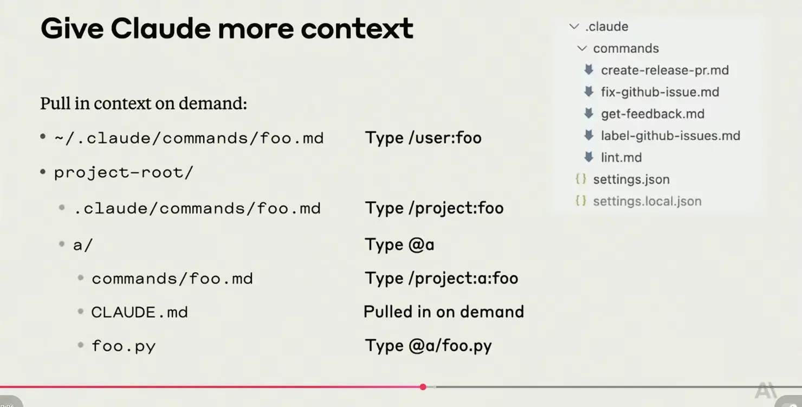

# Mastering Claude Code in 30 minutes 筆記
這是隨手筆記。時間有限。

# Tips
> Tip #1:   
> use codebase Q&A as a way to dip your feet into Claude Code   
> 使用「程式碼庫問答」作為入門方式，讓自己先試水溫了解 Claude Code。

> Tip #2:   
> practice prompting, and start to understand what Claude Code "gets" immediately vs. what needs more specific instructions   
> 練習撰寫提示語，並開始理解哪些內容 Claude Code 能立即理解、哪些需要更具體的指示。

> Tip #3:   
> teach Claude to use your tools   
> 教會 Claude 如何使用你的工具。

> Tip #4:   
> tailor the workflow to the task   
> 根據任務來調整工作流程。

> Tip #5:   
> the more context you give Claude, the smarter it will be   
> 你提供給 Claude 的上下文越多，它就會變得越聰明。

> Tip #6:   
> take time to tune context   
> 花時間調整上下文（context tuning）。   
> *Is it for you or your team? Do you want to add it automatically or lazily?*   
> *想想這是為你自己還是你的團隊使用？你希望它是自動添加還是延遲載入？*

> Tip #7:   
> configure CLAUDE.md, MCP servers, permissions, and slash commands for your team, and check them into git   
> 為你的團隊設定好 CLAUDE.md、MCP 伺服器、權限與斜線指令，並將它們提交到 Git 版本庫中。
   
# 參考來源
- bilibili [Anthropic内部员工2天快速入职的秘诀？官方创建者揭秘Claude Code终极用法](https://www.bilibili.com/video/BV1c5JDzyEH7/?spm_id_from=333.788.videopod.sections&vd_source=c0cbb7db1f35153d8ef998e4cbecdbe7)   
- youtube [Mastering Claude Code in 30 minutes](https://www.youtube.com/watch?v=6eBSHbLKuN0)  

# 演講投影片

